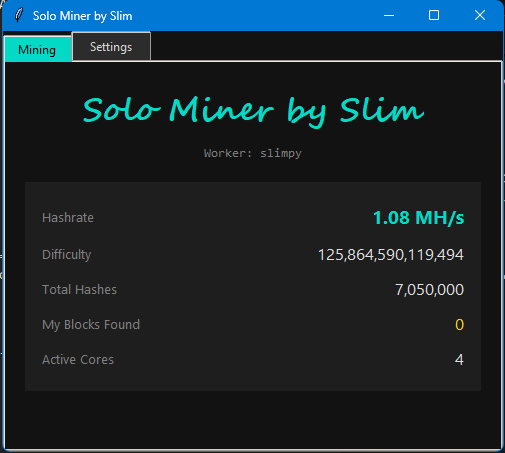

Solo Miner by Slim is a high-performance, educational Bitcoin miner written in Python. It is designed to run on your CPU and connects directly to the solo.ckpool.org mining pool.

While it functions as a real miner, please note that solo mining with a CPU is effectively a "Bitcoin Lottery." The odds of finding a block are incredibly low, but this tool provides a great way to understand how the Stratum protocol and hashing algorithms work, all wrapped in a sleek, dark-themed interface.
High Performance: Uses Python's multiprocessing to utilize every core of your CPU for maximum hashrate.
